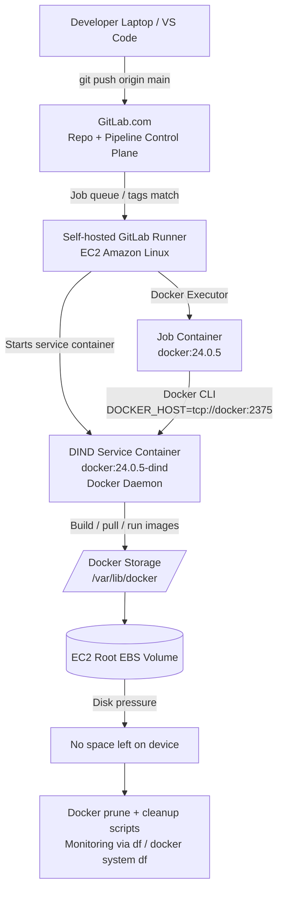

# 🦊 GitLab CI/CD Lab – Self-Hosted Runner, Docker Executor, DIND & Disk Cleanup

In this lab, I built a self-hosted GitLab Runner on AWS EC2 using the Docker executor, configured Docker-in-Docker, ran CI/CD jobs inside containers, built Docker images inside the pipeline, reproduced runner disk growth, simulated a `no space left on device` failure, and cleaned up Docker storage safely. 

---

## 🏗 Architecture Diagram



---

## 📋 Lab Overview

### 🎯 Goal

* Create a GitLab project
* Configure `.gitlab-ci.yml`
* Provision an EC2 runner host
* Install Docker and GitLab Runner
* Register a self-hosted runner
* Use the Docker executor
* Understand job containers vs service containers
* Configure Docker-in-Docker
* Build Docker images inside CI/CD
* Reproduce Docker disk growth
* Simulate runner disk failure
* Clean unused Docker data
* Add cleanup and monitoring ideas

---

## 📚 Learning Outcomes

By the end of this lab, I understood how to:

* Explain GitLab as the **control plane**
* Explain GitLab Runner as the **execution worker**
* Use runner tags to match jobs
* Run CI/CD jobs inside Docker containers
* Understand Docker CLI vs Docker daemon
* Use DIND for Docker builds inside pipelines
* Configure `DOCKER_HOST`
* Build Docker images from a `Dockerfile`
* Understand Docker build context
* Diagnose Docker disk usage
* Reclaim space with `docker system prune`
* Simulate and recover from runner disk exhaustion

---

## 🛠 Step-by-Step Journey

---

## Step 1: Create GitLab Project

Created a GitLab project:

```text
Group: devops-projects
Project: gitlab-runner-dind-lab
```

### 💡 Key Concept

GitLab project = repository + CI/CD configuration + issues + merge requests + pipeline history.

---

## Step 2: Understand GitLab Server vs Runner

### Core Architecture

| Component         | Role                                  |
| ----------------- | ------------------------------------- |
| GitLab.com        | Stores repo, pipelines, UI, job queue |
| GitLab Runner     | Polls GitLab for jobs                 |
| Executor          | Defines how jobs run                  |
| Job Container     | Runs script commands                  |
| Service Container | Runs supporting services              |

### 🧠 Mental Model

GitLab = manager
Runner = worker
Pipeline YAML = instruction sheet
Job container = temporary workbench

---

## Step 3: Understand Pull-Based Runner Architecture

GitLab does not SSH into the runner.

Instead:

```text
Runner → GitLab: “Do you have jobs for me?”
GitLab → Runner: “Yes, here is one matching your tags.”
```

### Why This Matters

* Runners can live in private subnets
* No inbound access required from GitLab
* Easier scaling
* Better security boundary

---

## Step 4: Create `.gitlab-ci.yml`

Created:

```bash
touch .gitlab-ci.yml
```

Committed and pushed:

```bash
git add .
git commit -m "Add initial GitLab CI pipeline"
git push origin main
```

### 💡 Git Reminder

| Command                | Purpose                |
| ---------------------- | ---------------------- |
| `git add .`            | Stage changes          |
| `git commit -m`        | Save local snapshot    |
| `git push origin main` | Send commits to GitLab |

---

## Step 5: Clone GitLab Repo Locally

Used a GitLab Personal Access Token for HTTPS Git authentication.

```bash
git clone <gitlab-repo-url>
cd gitlab-runner-dind-lab
```

### 💡 Important

If you sign into GitLab with Google/GitHub OAuth, Git over HTTPS usually still needs a GitLab token.

---

## Step 6: Provision EC2 Runner Host

Created EC2 instance:

| Setting       | Value              |
| ------------- | ------------------ |
| OS            | Amazon Linux       |
| Instance Type | t3.medium          |
| Storage       | 25 GB              |
| Purpose       | GitLab Runner host |

### Why not `t2.micro`?

Docker CI jobs need CPU, memory, image pulls, containers, and build storage. Tiny instances can fail or become slow quickly.

---

## Step 7: Install Docker

```bash
sudo yum update -y
sudo yum install -y docker
sudo systemctl enable --now docker
```

Validate:

```bash
sudo docker version
sudo docker ps
```

---

## Step 8: Understand Docker Permissions

Optional lab command:

```bash
sudo usermod -aG docker ec2-user
```

### ⚠️ Production Warning

Being in the `docker` group is powerful. It is close to root-level host control because Docker can mount filesystems and start privileged containers.

For production-style practice, using `sudo docker ...` is safer.

---

## Step 9: Check Docker Storage Location

```bash
sudo docker info | grep -i "Docker Root Dir"
```

Typical result:

```text
Docker Root Dir: /var/lib/docker
```

### 💡 Key Concept

Docker images, layers, containers, and build cache can consume runner disk over time.

---

## Step 10: Install GitLab Runner

Configured GitLab package repository, then installed runner:

```bash
curl -L "https://packages.gitlab.com/install/repositories/runner/gitlab-runner/script.rpm.sh" -o script.rpm.sh
sudo bash script.rpm.sh
sudo yum install gitlab-runner
```

### 💡 Package Repository Concept

YUM does not store every package locally.

It stores repo configuration, then downloads packages from remote repositories.

---

## Step 11: Understand GPG Package Verification

During install, YUM imports GitLab GPG public keys.

### Purpose

GPG signing verifies:

* package came from trusted publisher
* package was not modified

### 🧠 Mental Model

Package = document
GPG signature = tamper-proof signature
Public key = way to verify the signature

---

## Step 12: Register GitLab Runner

From GitLab project:

```text
Settings → CI/CD → Runners → New project runner
```

Runner tag:

```text
dind-lab
```

Register on EC2:

```bash
sudo gitlab-runner register
```

Used:

```text
GitLab URL: https://gitlab.com
Executor: docker
Default image: alpine:latest
```

Validated runner status:

```text
Online / Idle
```

---

## Step 13: Run Basic Docker Executor Job

Example `.gitlab-ci.yml`:

```yaml
stages:
  - test

basic-test-job:
  stage: test
  tags:
    - dind-lab
  image: alpine:latest
  script:
    - echo "Hello from inside the job container"
    - hostname
    - pwd
    - df -h
    - cat /etc/os-release
```

### 💡 Key Discovery

These commands run inside the **job container**, not directly on EC2.

So:

```bash
cat /etc/os-release
```

shows Alpine Linux, not Amazon Linux.

---

## Step 14: Understand Containers vs Host OS

| Location      | OS View                        |
| ------------- | ------------------------------ |
| EC2 Host      | Amazon Linux                   |
| Job Container | Alpine / Ubuntu / chosen image |

### 🧠 Key Concept

Containers share the host kernel but have separate user spaces.

---

## Step 15: Prove Docker CLI ≠ Docker Daemon

Created job using Docker CLI image without DIND:

```yaml
docker-without-dind:
  stage: test
  tags:
    - dind-lab
  image: docker:24.0.5
  script:
    - docker version
    - docker ps
```

### Result

`docker version` showed client info.

`docker ps` failed because no Docker daemon was available.

### 💡 Key Lesson

Docker CLI sends requests.

Docker daemon actually performs Docker operations.

---

## Step 16: Enable Docker-in-Docker

Edited GitLab Runner config:

```bash
sudo vi /etc/gitlab-runner/config.toml
```

Set:

```toml
privileged = true
```

Restarted runner:

```bash
sudo systemctl restart gitlab-runner
sudo systemctl status gitlab-runner
```

### ⚠️ Production Warning

`privileged = true` gives containers deeper access to host kernel features. Use only for trusted runners/projects.

---

## Step 17: Run Docker with DIND

```yaml
stages:
  - test

docker-with-dind:
  stage: test
  tags:
    - dind-lab
  image: docker:24.0.5
  services:
    - name: docker:24.0.5-dind
      alias: docker
  variables:
    DOCKER_HOST: tcp://docker:2375
    DOCKER_TLS_CERTDIR: ""
  script:
    - docker version
    - docker ps
    - docker info
```

### 💡 How It Works

| Component       | Purpose                                 |
| --------------- | --------------------------------------- |
| `image: docker` | Job container with Docker CLI           |
| `docker:dind`   | Service container running Docker daemon |
| `alias: docker` | DNS name for daemon container           |
| `DOCKER_HOST`   | Tells CLI where daemon lives            |
| `2375`          | Docker daemon TCP port                  |

---

## Step 18: Build Docker Image in CI/CD

Created `Dockerfile`:

```Dockerfile
FROM alpine:latest
RUN echo "built inside GitLab CI" > /message.txt
CMD ["cat", "/message.txt"]
```

Pipeline:

```yaml
stages:
  - build

build-image:
  stage: build
  tags:
    - dind-lab
  image: docker:24.0.5
  services:
    - name: docker:24.0.5-dind
      alias: docker
  variables:
    DOCKER_HOST: tcp://docker:2375
    DOCKER_TLS_CERTDIR: ""
  script:
    - docker build -t dind-lab-image:$CI_COMMIT_SHORT_SHA .
    - docker images
    - docker run --rm dind-lab-image:$CI_COMMIT_SHORT_SHA
```

---

## Step 19: Understand Docker Build Context

```bash
docker build -t image-name .
```

The final `.` means:

```text
Use current directory as build context
```

Before the script runs, GitLab Runner clones the repo into the job container.

That means the job container can access:

* `.gitlab-ci.yml`
* `Dockerfile`
* repo files

---

## Step 20: Reproduce Docker Disk Growth

Updated pipeline to pull multiple images:

```yaml
script:
  - df -h
  - docker pull ubuntu:22.04
  - docker pull python:3.11
  - docker pull node:20
  - docker images
  - docker system df
  - df -h
```

Ran pipeline multiple times.

Checked EC2:

```bash
df -h
sudo du -sh /var/lib/docker
sudo docker system df
```

### 💡 Lesson

Job containers are temporary, but Docker images/layers/cache can remain on the runner host.

---

## Step 21: Simulate Runner Disk Failure

Created large files:

```bash
sudo fallocate -l 5G /bigfile1.image
sudo fallocate -l 5G /bigfile2.image
sudo fallocate -l 6G /bigfile3.image
sudo fallocate -l 800M /bigfile5.image
```

Checked disk:

```bash
df -h
```

Root disk reached nearly full.

Pipeline failed with:

```text
no space left on device
```


---

## Step 22: Recover Disk Space

Removed fake files:

```bash
sudo rm -f /bigfile1.image /bigfile2.image /bigfile3.image /bigfile4.image /bigfile5.image
```

Checked:

```bash
df -h
```

---

## Step 23: Clean Docker Data

Checked Docker usage:

```bash
sudo docker system df
```

Cleaned unused Docker data:

```bash
sudo docker system prune --all --force
```

Checked again:

```bash
sudo docker system df
sudo du -sh /var/lib/docker
df -h
```

### 💡 What This Removes

* unused containers
* unused networks
* unused images
* build cache

---

## Step 24: Add Scheduled Cleanup Idea

Create daily cleanup script:

```bash
sudo vi /usr/local/bin/docker-cleanup.sh
```

Example:

```bash
#!/bin/bash
docker system prune --all --force
```

Make executable:

```bash
sudo chmod +x /usr/local/bin/docker-cleanup.sh
```

Schedule:

```bash
sudo crontab -e
```

Example daily 2 AM:

```cron
0 2 * * * /usr/local/bin/docker-cleanup.sh
```

---

## Step 25: Add Disk Monitoring Idea

Example check:

```bash
df -h /
docker system df
```

Useful threshold:

```text
Warn if root disk > 80%
Critical if root disk > 90%
```

---

## ✅ Key Commands Summary

| Task                        | Command                                         |
| --------------------------- | ----------------------------------------------- |
| Clone repo                  | `git clone <url>`                               |
| Stage changes               | `git add .`                                     |
| Commit changes              | `git commit -m "message"`                       |
| Push changes                | `git push origin main`                          |
| Install Docker              | `sudo yum install -y docker`                    |
| Start Docker                | `sudo systemctl enable --now docker`            |
| Install GitLab Runner       | `sudo yum install gitlab-runner`                |
| Register runner             | `sudo gitlab-runner register`                   |
| Restart runner              | `sudo systemctl restart gitlab-runner`          |
| Check runner status         | `sudo systemctl status gitlab-runner`           |
| Check Docker root dir       | `sudo docker info \| grep -i "Docker Root Dir"` |
| Check disk usage            | `df -h`                                         |
| Check Docker usage          | `sudo docker system df`                         |
| Check Docker directory size | `sudo du -sh /var/lib/docker`                   |
| Clean Docker                | `sudo docker system prune --all --force`        |
| Simulate disk pressure      | `sudo fallocate -l 5G /bigfile.image`           |

---

## 💡 Notes / Tips

* GitLab is the control plane; runners are execution workers
* Runners poll GitLab; GitLab does not SSH into runners
* Runner tags control which jobs a runner can pick up
* Docker executor runs jobs inside containers
* Job container runs script commands
* Service containers run beside the job container
* DIND provides a Docker daemon for Docker builds
* Docker CLI does not equal Docker daemon
* `DOCKER_HOST` tells CLI where the daemon lives
* Docker build context controls what files Docker can see
* Docker layers/cache can fill runner disks over time
* `docker system prune --all --force` is useful but should be used carefully
* Production runners need disk monitoring and cleanup automation
* Privileged DIND runners should be isolated and trusted
